# End-to-end Assessment — Genesis Mission Partner Navigator

**Date:** 2026-05-09
**Persona:** BioKEA stakeholder (investor / DOE program officer). Optimize for "does this prove BioKEA understands the field and built something credible?"
**Scope:** `/` (Canvas) + `/composer`
**Methodology:** Live walk-through of six user journeys (A–F) via Playwright at 1600×1000 / 2× device scale; data spot-check of 10 randomly-sampled matches (seed 42); read of the few suspect source files. Screenshots saved to `screenshots/2026-05-09/`.

---

## TL;DR

| Dimension | Grade | Why |
|---|---|---|
| First-impression legibility | **B** | Pink concept hubs and cyan partner mass land cleanly. No onboarding hint about what the colors mean — visitor has to infer. |
| Visual polish + cohesion | **D** | Canvas is polished; **Composer is broken-looking** in the new dark App shell — black cards, invisible-or-missing text. Two routes don't feel like the same product. |
| Demo flow | **D** | A 90-second Canvas walk works. Clicking "Composer" mid-demo would derail it. |
| Credibility signals | **A** | 10/10 sampled match rationales are concrete and specific. Stat strip + BioKEA logo + footer credit + per-match rationales each carry weight. |
| Information density | **B** | Right pane partner card has 14+ concept tags + 12 match rationales of ~80 words each. Dense but interpretable. Could collapse for skim mode. |
| Detail polish | **C** | NotFound link still says "Back to browse" (browse was deleted). SearchBox file lives in source but is never imported. Bogus partner slug silently no-ops with no message. |
| Composer integration | **F** | Visually clashes (light theme assumption breaks under dark App shell), AND ignores `matches.json` entirely — Plan 2's whole rationale layer is invisible to the team-builder. |

**Overall read:** The Canvas alone is a credible demo asset. **Composer is the single biggest liability** — it is what an investor would click on the second tab and form a "this is half-finished" impression from. Two follow-up bodies of work, in priority order: (1) fix or hide Composer, (2) add a 5-second onboarding hint to the Canvas.

---

## Methodology details

A throwaway Playwright script (`/tmp/assessment-capture.mjs`, not committed) drove the local dev server through six journeys. Each journey opens a fresh browser context (no shared cache or layout state) so the screenshots reflect what a real visitor sees on first load. Captures are at 1600×1000 viewport, 2× device pixel ratio.

Data spot-check used a deterministic LCG sample of 10 matches from `app/data-source/matches.json` (29,443 total).

---

## Journey-by-journey findings

### Journey A — Cold landing (`/`)

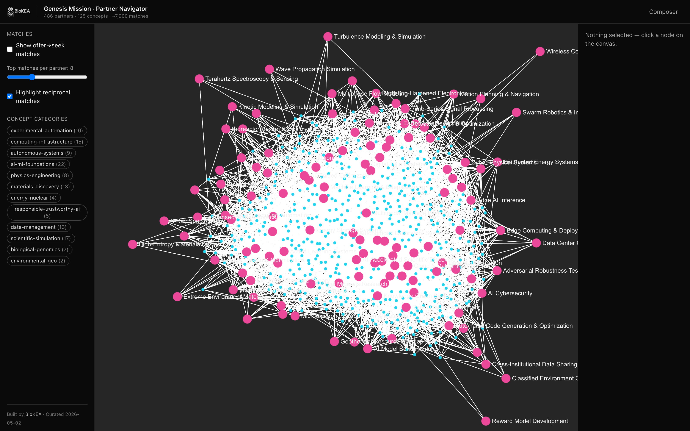

**What works.** The bipartite shape is immediately legible: pink concept hubs ring a dense cyan partner mass. Concept labels on the periphery (Turbulence Modeling & Simulation, Wave Propagation Simulation, Wireless Communications, Reward Model Development) are readable. The TopBar carries the BioKEA brand mark plus the stat strip "486 partners · 125 concepts · ~7,900 matches" — credibility front-and-center. LeftPane footer "Built by BioKEA · Curated 2026-05-02" reinforces.

**What doesn't.** A visitor with no prior context has to *infer* that pink = concept and cyan = partner. There is no onboarding overlay, no legend, no "click any node" hint. The default `Top matches per partner: 8` slider is shown but the match overlay is OFF, which makes the slider look like an unused control.

**Other.** The right pane reads "Nothing selected — click a node on the canvas." That is the only call-to-action visible, and it's tucked in the right rail at small text size.

### Journey B — The map (toggles + slider + filter)

| State | Screenshot |
|---|---|
| Matches on, k=8 | 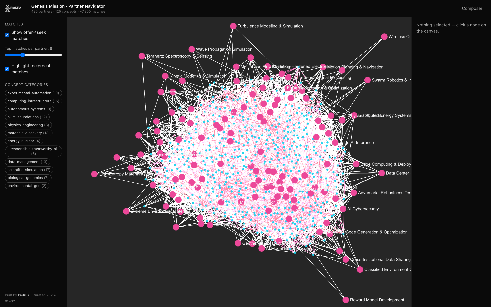 |
| Matches on, k=3 | 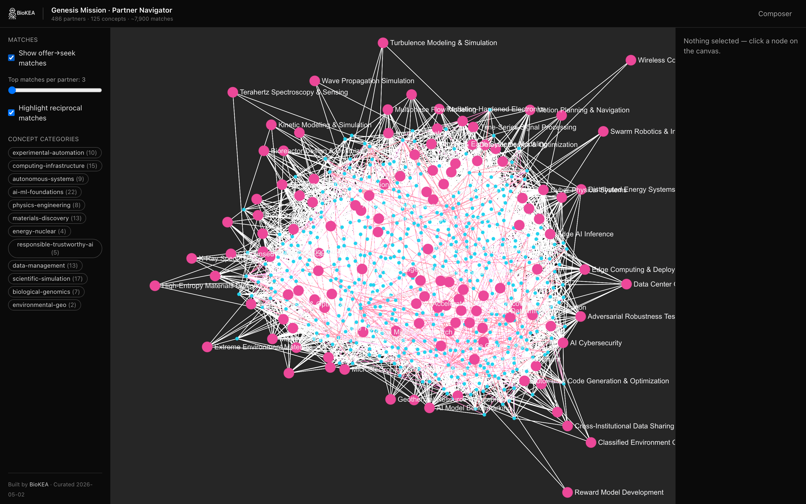 |
| Matches on, k=20 | 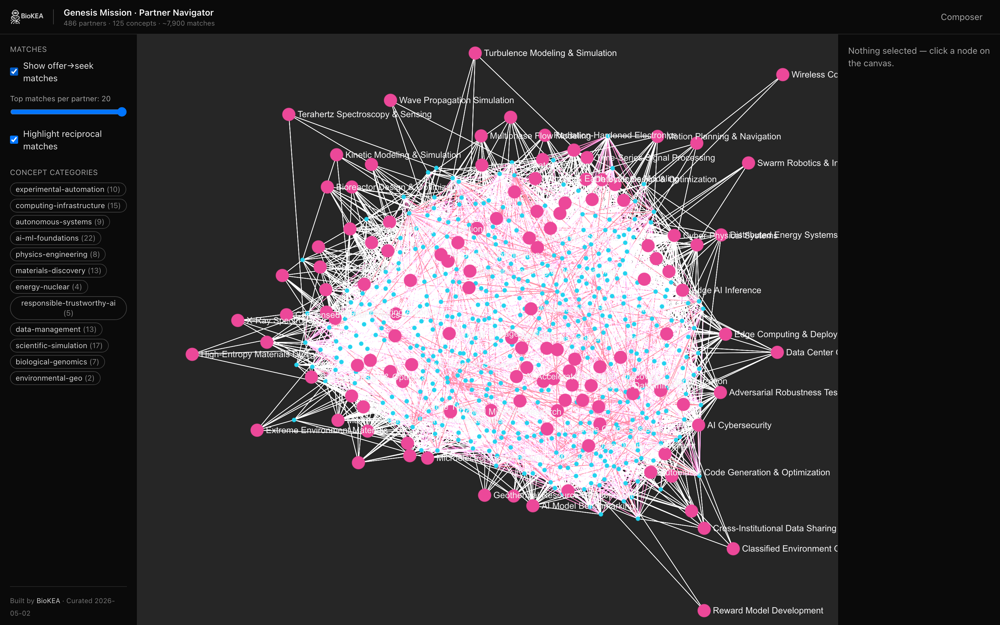 |
| Reciprocity highlight off | 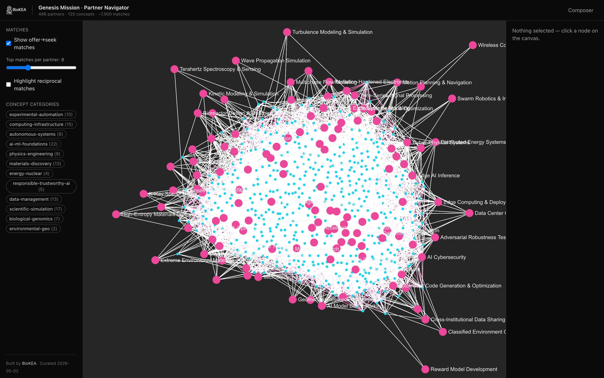 |
| Category filter: biological-genomics | 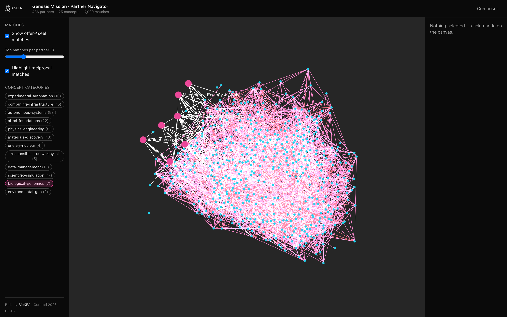 |

**What works.** All four LeftPane controls are responsive. Slider drags are smooth and the visible match-edge density changes immediately. Reciprocity-off flattens reciprocal edges into the same dim style as non-reciprocal — verifiable. Category-chip filter cleanly hides off-category concepts.

**What doesn't.** With matches on and k=8, the canvas is **mostly pink edge soup** in the middle (B1). At k=20 (B3) you can no longer pick out the underlying bipartite scaffolding. The match overlay's value gets diluted at higher k. The category filter (B5) hides concept *nodes* but match edges between partners stay everywhere — which is technically correct but visually inconsistent (filter feels half-applied).

### Journey C — Partner deep-link

| Step | Screenshot |
|---|---|
| `/#/profile/biokea` | 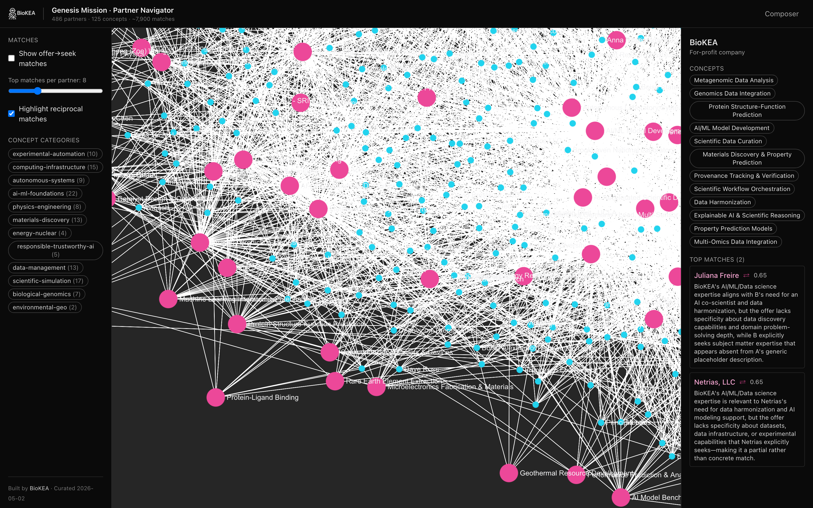 |
| After clicking first concept tag | 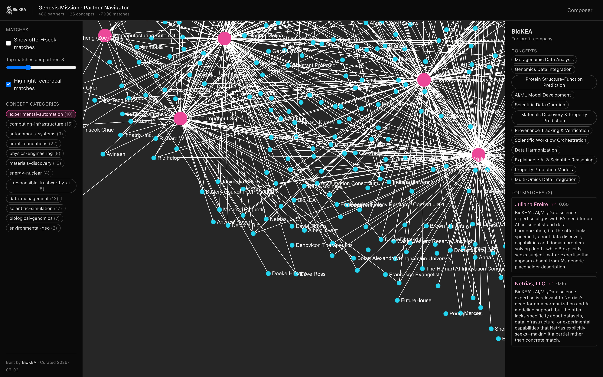 |
| After clicking first match name | 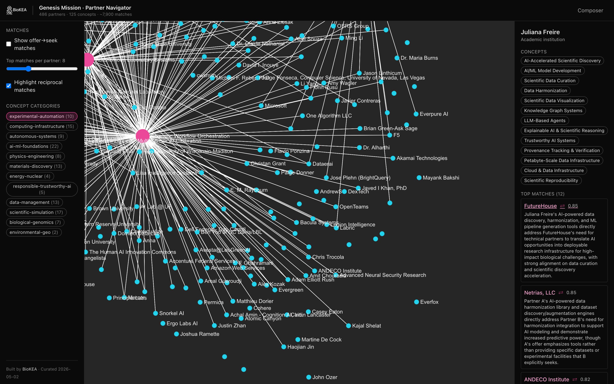 |

**What works.** Camera animates to the BioKEA node on load. Right pane is rich: affiliation, 14 concept tags, 12 top matches each with score + rationale + reciprocity glyph. Clicking a concept tag swaps the right pane to the concept card. Clicking a match name pushes `/profile/<slug>` to the URL — verified by capturing the URL after click: `http://localhost:5173/#/profile/juliana-freire`. Browser back/forward works.

**What doesn't.** The right pane is ~600+ pixels of vertical content. Without a "show top 3 / show all" collapse, you scroll past the highest-value matches to see the rest. Match score `0.65` is not contextualized — is that good or weak? (It's actually meaningful — anything below 0.5 was dropped at the noise floor — but the user doesn't know that.)

### Journey D — Composer

| Step | Screenshot |
|---|---|
| Landing | 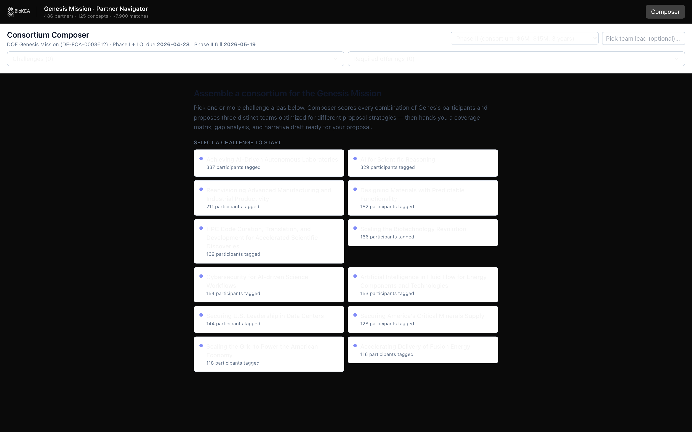 |
| After click attempt | 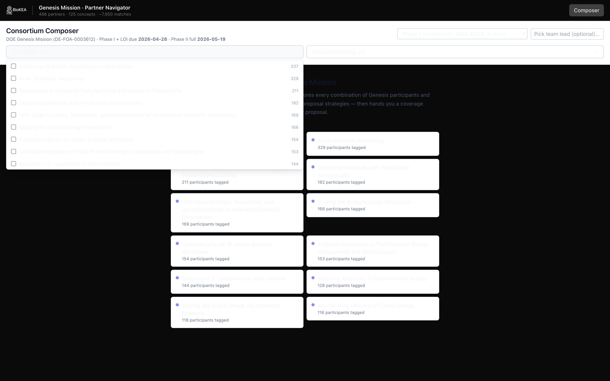 |

**What works.** The TopBar branding survives the route change. The page title "Consortium Composer" reads clearly.

**What doesn't.** Almost everything else. The black challenge cards on a white background appear to have **invisible white text** because the dark App shell (`bg-neutral-950 text-neutral-100`) is leaking into Composer's surfaces that expected a white background. You can see participant counts ("337 participants tagged", "329 participants tagged") but the actual challenge labels above them are blank. The setup bar at the top has empty input fields. Nothing in the route was designed for the dark App shell.

**Independently:** Composer also does not consume `matches.json`. The team-building algorithm uses `lib/coverage.ts` and `lib/team-builder.ts` (legacy similarity-based scoring). The whole rationale + reciprocity layer that Plan 2 produced is invisible here.

### Journey E — Share + reload

The captured URL `http://localhost:5173/#/profile/biokea` was opened in a fresh browser context. The right pane restored BioKEA's profile correctly. **Share works.**

### Journey F — Edge cases

| Case | Screenshot |
|---|---|
| Bogus partner slug `/profile/does-not-exist-12345` | 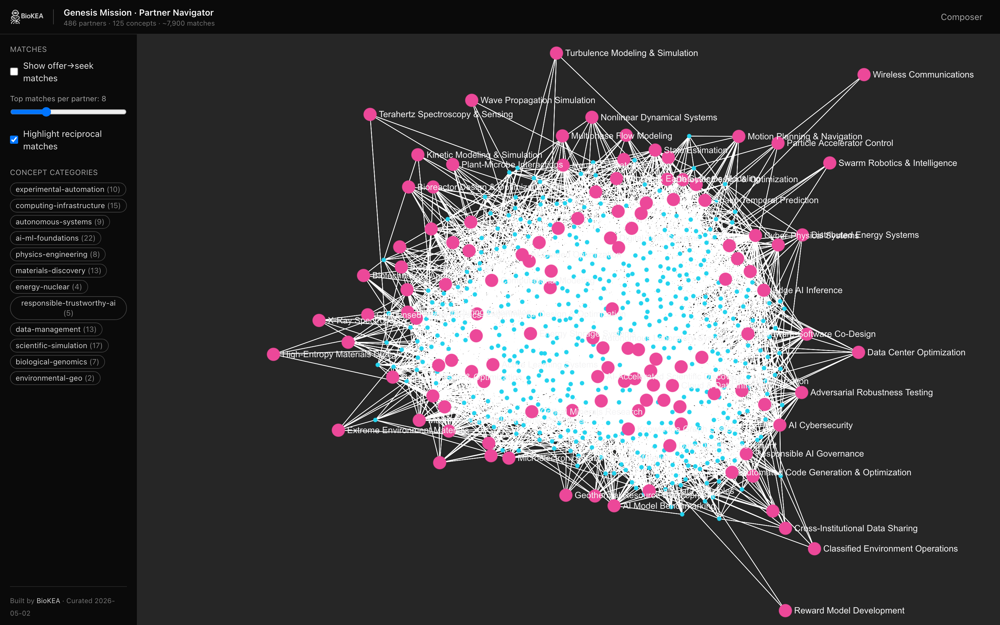 |
| Bogus route `/this-route-does-not-exist` | 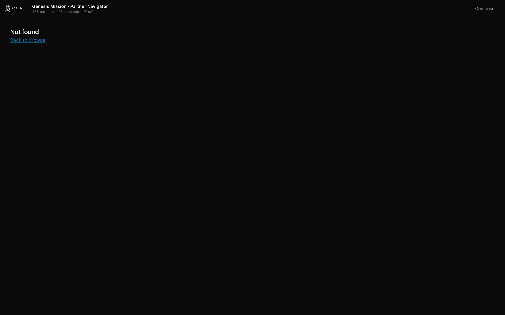 |

**Bogus slug** silently shows the canvas with no selection — graceful but no feedback ("we don't know that partner").

**Bogus route** renders a NotFound page with a link labeled **"Back to browse"** — but `/browse` no longer exists. The `to=/` is correct so it works, but the label is wrong. (`app/src/routes/NotFound.tsx:6`)

---

## Data spot-check

10 random matches, seed 42, drawn from 29,443 total in `app/data-source/matches.json`.

**Verdict: 10/10 concrete and specific.** No padding-only rationales in this draw. Average length ~80 words. Each names specific tools, capabilities, datasets, and identifies a specific gap.

**Best example** (`university-wisconsin-madison → tung-nguyen`, score 0.72):

> UW–Madison offers strong AI/ML expertise, **substantial HPC infrastructure (40,000 CPU + 80+ GPU slots)**, **relevant datasets (genomic/metabolomic from GLBRC, cryo-EM imaging)**, and deep bioscience domain knowledge (bioenergy, biotech startups, translational research experience), which directly address B's needs for AI platforms, computing capacity, and biotech datasets; however, the match weakens on **specialized cGMP biomanufacturing test beds and regulatory/commercial biomanufacturing expertise**, where UW–Madison's offerings are research-focused rather than production-scale or FDA-aligned.

Specific HPC slot count, named datasets, named gap (cGMP). This is the credibility surface working as designed.

**Weakest example** (`rs → tristan-horner`, score 0.65):

> Partner A's expertise in HPC, Neural Networks, and Digitalization directly addresses B's core computing infrastructure and AI-enabled analysis needs; however, the offer lacks specificity about geoscience datasets, DOE National Lab affiliation, Earth-system domain knowledge, and critical minerals expertise that are central to B's request.

Thinner — but the thinness is honest: the source profile "rs" is itself a near-empty profile. The model correctly says so.

**Parse errors** (`app/public/data/parse-errors.json`): empty array. No partner profiles failed to parse.

---

## Specific issues caught

| # | Issue | Where | Severity |
|---|---|---|---|
| 1 | Composer route renders broken in the new dark App shell — invisible text, theme clash, looks unfinished | `app/src/routes/Composer.tsx` | **High** |
| 2 | Composer ignores `matches.json` — team scoring uses only legacy similarity, not the LLM rationales | `app/src/lib/team-builder.ts` (consumer); `app/data-source/matches.json` (unconsumed) | **High** |
| 3 | NotFound link labeled "Back to browse" but browse route was deleted | `app/src/routes/NotFound.tsx:6` | Medium |
| 4 | `SearchBox.tsx` defined but never imported — dead code, also contains stale "443 partners" text | `app/src/components/SearchBox.tsx` | Medium |
| 5 | Bogus partner slug silently no-ops — no "partner not found" hint to the visitor | `app/src/routes/Canvas.tsx` (slug effect) | Low |
| 6 | No onboarding / legend on Canvas — pink-vs-cyan and bipartite structure must be inferred | `app/src/canvas/GraphCanvas.tsx` (no overlay), or LeftPane | Medium |
| 7 | Right-pane match cards lack a "show top 3 / show all" collapse — long scroll | `app/src/canvas/RightPane.tsx` | Low |
| 8 | Match score `0.65` shown without context (good? bad?). Could surface "0.5 = noise floor, 1.0 = perfect" | `app/src/canvas/RightPane.tsx` | Low |
| 9 | At top-K = 20 the match overlay is visually impenetrable; the slider's upper range is past the useful threshold | `app/src/canvas/LeftPane.tsx`, `app/src/routes/Canvas.tsx` | Low |
| 10 | Category filter hides concept nodes but doesn't dim match edges between partners — feels half-applied | `app/src/routes/Canvas.tsx` (match edge effect) | Low |
| 11 | `network.json` is loaded by `loadCanvasData` but never consumed by the new Canvas | (per Phase-1 survey) `app/src/canvas/lib/load-canvas-data.ts` | Low |
| 12 | Mobile / responsive layout absent — fixed 220 px LeftPane + 260 px RightPane will break <800 px wide | All Canvas + Composer | Low (unless mobile is a target) |

---

## Prioritized fix list (Plan 4 candidates)

Effort: **S** ≤ ½ day, **M** ½–2 days, **L** > 2 days. Impact: **Hi** = visible to first-time stakeholder, **Med** = visible after 30 sec exploring, **Lo** = polish.

| Priority | Item | Effort × Impact | Notes |
|---|---|---|---|
| **P0** | **Fix or hide Composer** — either retheme it for the dark shell *or* add a "Coming soon — preview the Composer" placeholder. | **M × Hi** | Single biggest credibility risk. Even hiding it behind a feature flag would be better than the current broken-looking render. |
| **P0** | **Onboarding hint on first Canvas load** — small dismissable overlay: "Pink = research concepts. Cyan = partners. Click any node, or toggle matches in the left rail." Persist dismiss in `localStorage`. | **S × Hi** | Spec already calls for this (§ 4 of design spec); was deferred from Plan 3. |
| **P1** | **Wire Composer to use `matches.json`** — surface a per-team match-rationale section so the LLM rationales become visible in the team-building flow. | **M × Hi** | Plan 2's biggest payoff is invisible without this. |
| **P1** | **Right-pane match-list collapse** — "Top 3 matches · show 9 more". Tightens the partner-card density. | **S × Med** | Trivial UX win. |
| **P1** | **Score legend** — single sentence under the matches header: "0.50 = weak match, 1.00 = perfect fit. Reciprocal ⇄ matches both directions." | **S × Med** | Restores meaning to the numbers. |
| **P2** | **Better NotFound page** — change "Back to browse" → "Back to canvas". Optionally show a search box to find a partner by name. | **S × Lo** | One-line label fix; search box adds value. |
| **P2** | **Bogus-slug feedback** — when `/profile/<slug>` doesn't match, show a small "We don't have a partner named '<slug>'. Pick one from the canvas." in the right pane. | **S × Lo** | Saves a confused refresh. |
| **P2** | **Slider upper bound to 12 instead of 20** — drop the impenetrable end of the range. Or auto-fade match edges below k=15 to mitigate clutter. | **S × Lo** | Calibrates to what's actually useful. |
| **P3** | **Delete `SearchBox.tsx`** (dead code) and any other orphans. | **S × Lo** | Hygiene. |
| **P3** | **Stop shipping `network.json`** (~13 KB unused at runtime) since canvas doesn't use it. | **S × Lo** | Bundle hygiene. |
| **P3** | **Dim match edges between hidden-category partners** when the category filter is on — make the filter feel "fully applied". | **S × Lo** | Consistency. |
| **Plan 4+** | **Mobile responsive pass** — only if mobile demos / share-link clicks from phones are on the roadmap. Otherwise label the desktop-only constraint and move on. | **L × ?** | Out of scope unless explicitly needed. |

---

## What's notably *good* (worth preserving as we iterate)

- **Match rationales are the credibility surface working as designed.** Specific HPC slot counts, named datasets, named gaps. Don't compress these aggressively when polishing the right pane.
- **The cold-landing image works as a screenshot for marketing or pitch decks.** Pink-on-dark is striking and the bipartite shape carries a "this is real network science" signal.
- **Camera follow on selection** (Plan 3 follow-up) is the small-but-magic touch — clicking a node and being smoothly zoomed to it sells the interactivity in <2 seconds.
- **Stat strip in TopBar** ("486 partners · 125 concepts · ~7,900 matches") is doing meaningful work as a quiet credibility signal.
- **URL push on partner selection** means a presenter can copy and Slack a partner-specific link mid-call. Subtle but high-value.

---

## Verification artifacts

- 13 PNGs in `screenshots/2026-05-09/` — A1, B1–B5, C1–C3, D1–D2, E1, F1–F2.
- Capture script: `/tmp/assessment-capture.mjs` (throwaway, not committed; reproducible by re-running against a local dev server on port 5173).
- Match sample seed: 42 (deterministic — re-runnable).

---

## Out of scope (and why)

- **Code changes.** Plan said no edits during the assessment. Issues caught are queued in the prioritized list above for a follow-up Plan 4.
- **Mobile testing.** Already known to be desktop-only; a real responsive pass is a separate effort and only matters if mobile demos are on the roadmap.
- **Accessibility audit.** Phase-1 survey flagged obvious gaps (limited keyboard nav around the WebGL canvas, missing aria on category chips). A real a11y audit deserves its own pass.
- **Comparison benchmarking** against other partner platforms — not requested.
